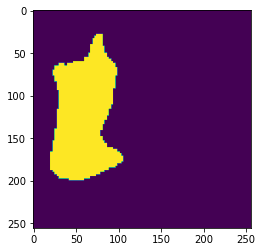

# Hand-Pose-Estimation-
HandPose estimation with hand segmentation and keypoint detection using Encoder-Decoder CNN in Pytorch 

[TO BE UPDATED]

<h1>Demo</h1>

  </img>
  </img>
  </img>
  </img>

  </img>
  </img>
  </img>
  </img>

